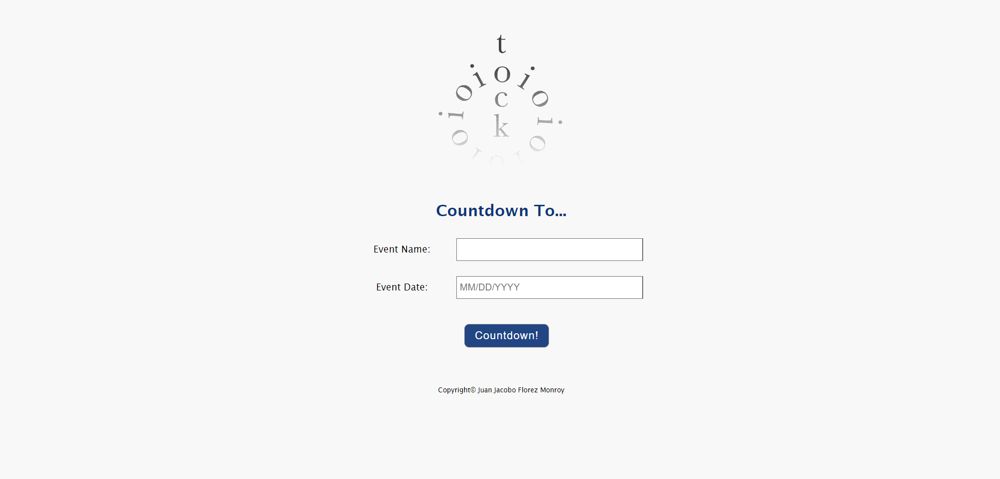

# 🕒 Event Countdown Application

## 📌 Project Overview

The **Event Countdown Application** allows users to **input an event date** and dynamically calculates:

- ⏳ How many days remain **until the event**.
- 🎉 If the event is **happening today**.
- 📅 How many days have **passed since the event**.

This project was developed as a **college assignment**, showcasing skills in **JavaScript date manipulation, input validation, and dynamic UI updates**.

---

## 🌍 Live Demo

🚀 **Try it out here**: [Event Countdown Live Demo](https://event-countdown-three.vercel.app)

---

## 🚀 Features

- **📝 User Input for Events** – Users can enter an **event name** and a **specific date**.
- **💬 Dynamic Countdown Messages**:
  - If the event is **today** → Displays *"Hooray! Today is [Event Name]!"*
  - If the event is in the **future** → Displays *"[X] day(s) until [Event Name]!"*
  - If the event has **passed** → Displays *"[Event Name] happened [X] day(s) ago."*
- **✔️ Input Validation** – Ensures:
  - A valid **event name** is provided.
  - Date is in the correct **MM/DD/YYYY** format.
  - Input errors trigger **real-time feedback**.
- **📱 Responsive Design** – Ensures usability on different screen sizes.

---

## 🛠 Technologies Used

- **🌐 HTML5** → Structures the user interface.
- **🎨 CSS3** → Provides responsive and visually appealing styles.
- **📚 JavaScript (ES6)** → Handles countdown calculations and dynamic messages.
- **🔄 jQuery** → Simplifies event handling and DOM manipulation.

---

## 🎯 Project Purpose

This project was created as part of a **college assignment**, allowing me to practice:

- ✅ **JavaScript Date Manipulation** – Calculating time differences between events and the current date.
- ✅ **User Input Handling & Validation** – Ensuring accurate user input for reliable countdown calculations.
- ✅ **Dynamic UI Updates** – Providing real-time feedback through dynamic messages.
- ✅ **DOM Manipulation** – Using JavaScript and jQuery for interaction.
- ✅ **Error Handling** – Validating date formats and handling incorrect input gracefully.

---

## 📂 Project Structure

📚 count_down
 ├── 📁 imgs/               # Image assets (icons, backgrounds, etc.)
 ├── 📄 index.html          # Main HTML file for the application
 ├── 📄 count_down.css      # Stylesheet for layout and design
 ├── 📄 count_down.js       # JavaScript for countdown logic and validation

---

## 🏃‍♂️ How to Use the Application

1️⃣ **Enter Event Details**:
   - Provide an **event name**.
   - Enter the event date in **MM/DD/YYYY** format.

2️⃣ **Start Countdown**:
   - Click the **"Countdown!"** button.

3️⃣ **View Results**:
   - Displays a message indicating:
     - ⏳ How many days remain until the event.
     - 🎉 If the event is today.
     - 📅 How many days have passed since the event.

4️⃣ **Correct Errors**:
   - If an **input error** occurs (e.g., invalid date format), the application provides a **real-time error message**.

---

## 📝 Code Highlights

### Countdown Calculation (count_down.js):

- **Date Validation** – Ensures valid format and checks date ranges.
- **Days Calculation** – Determines the difference between the event date and today's date.
- **Dynamic Messaging**:

```javascript
if (daysToDate == 0) {
    msg = `Hooray! Today is ${formattedName}! (${date})`;
} else if (daysToDate > 0) {
    msg = `${daysToDate} day(s) until ${formattedName}! (${date})`;
} else {
    daysToDate = Math.abs(daysToDate);
    msg = `${formattedName} happened ${daysToDate} day(s) ago. (${date})`;
}
```

---

## 🌟 Future Improvements

- 📆 **Graphical Date Picker** – Simplify date input with a calendar widget.
- 🔔 **Notification Feature** – Add reminders for upcoming events.
- 🎨 **Theme Customization** – Allow users to switch between different themes.

---

## 🎭 Screenshots  

| Event Countdown |  
|--------------|  
|  |  

---

## 📜 License

This project was developed for **educational purposes** as part of a **college assignment**.

---

## 💼 Author

👤 **Juan Jacobo Florez Monroy**  
🌐 **Portfolio**: [jjacobo95.com](https://jjacobo95.com)  
🐙 **GitHub**: [github.com/jjacoboflorez95](https://github.com/jjacoboflorez95)