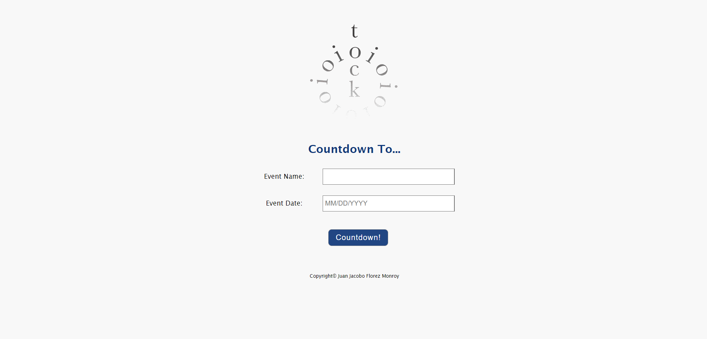

# 🕒 Event Countdown Application

## 📌 Project Overview

The **Event Countdown Application** allows users to input a future or past event with a specific date. The system calculates and displays:

- How many days are left until the event.
- If it is today.
- How many days ago the event occurred.

## 🚀 Features

- **User Input for Events**:

  - Users can enter an event name and a date for that event.

- **Dynamic Countdown Messages**:

  - If the event is **today**: Displays *"Hooray! Today is [Event Name]!"*
  - If the event is in the **future**: Displays *"[X] day(s) until [Event Name]!"*
  - If the event has **passed**: Displays *"[Event Name] happened [X] day(s) ago."*

- **Input Validation**:

  - Ensures the event name is provided.
  - Checks that the date is valid and in the correct `MM/DD/YYYY` format.

## 📂 Project Structure

```
📁 count_down
 ├── 📁 imgs/               # Image assets (icons, backgrounds, etc.)
 ├── 📄 index.html          # Main HTML file for the application
 ├── 📄 count_down.css      # Stylesheet for layout and design
 ├── 📄 count_down.js       # JavaScript for countdown logic and validation
```

## 🛠 Technologies Used

- **HTML5**: Structures the user interface.
- **CSS3**: Provides responsive and visually appealing styles.
- **JavaScript (ES6)**: Handles countdown calculations, validation, and dynamic messages.
- **jQuery**: Simplifies DOM manipulation and event handling.

## 🏃‍♂️ How to Use the Application

1. **Enter Event Details**:

   - Provide the event name in the "Event Name" field.
   - Enter the event date in `MM/DD/YYYY` format.

2. **Start Countdown**:

   - Click the **"Countdown!"** button.

3. **View Results**:

   - A dynamic message will appear, indicating:
     - How many days remain until the event.
     - If the event is today.
     - How many days have passed since the event.

4. **Correct Errors**:

   - If an input error occurs (e.g., invalid date format), the application will provide a relevant error message.

## 📝 Code Highlights

### Countdown Calculation (`count_down.js`):

- **Date Validation**:

  - Checks for valid month, day, and year.
  - Validates the `MM/DD/YYYY` format.

- **Days Calculation**:

  - Computes the difference between the event date and the current date.
  - Adjusts for past or future dates.

### Dynamic Messaging:

```javascript
if (daysToDate == 0) {
    msg = `Hooray! Today is ${formattedName}! (${date})`;
} else if (daysToDate > 0) {
    msg = `${daysToDate} day(s) until ${formattedName}! (${date})`;
} else {
    daysToDate = Math.abs(daysToDate);
    msg = `${formattedName} happened ${daysToDate} day(s) ago. (${date})`;
}
```

## 🌟 Future Improvements

- **Graphical Date Picker**: Simplify date input with a calendar widget.
- **Notification Feature**: Add reminders for upcoming events.
- **Theme Customization**: Allow users to choose different themes for the application.

## 🎭 Screenshots  

| Event Countdown |  
|--------------|  
|  |  

## 📜 License

This project was developed for educational purposes as part of a **college assignment**.

---

💼 **Author:** Juan Jacobo Florez Monroy | 🚀 Portfolio: [Portfolio Website or GitHub]